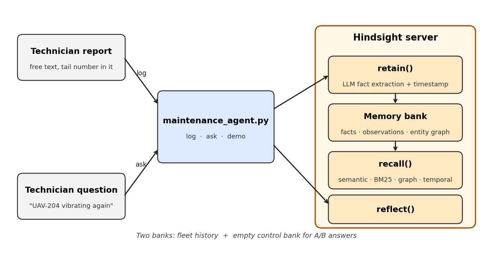

# Aerospace Maintenance Intelligence Agent

An assistant that remembers the maintenance history of each aircraft and component, and uses it when a new fault is reported. Built on [Hindsight](https://github.com/vectorize-io/hindsight) for agent memory.

**Without memory:** "Inspect the motor and bearings."

**With memory:** "UAV-204 previously had high-RPM vibration and a bearing replacement. Check bearing condition, shaft alignment and high-RPM vibration before replacing the motor."

## The problem

Maintenance teams produce inspection reports, fault write-ups, component swaps and technician notes. The most useful details live in free text ("vibration worse at high RPM"), which structured databases never capture. When the same fault returns months later, that history is hard to find.

## How it works



The agent is a single Python module that talks to a Hindsight server:

| Command | What it does | Hindsight call |
|---|---|---|
| `log` | Stores a new maintenance report with its event timestamp | `retain()` |
| `ask` | Answers a fault question using the fleet's history | `reflect()` |
| `demo` | Loads sample history, then compares answers with and without memory | all three, plus `recall()` for evidence |

Design decisions:

- **One bank for the whole fleet.** Aircraft identity ("UAV-204") is in the report text and retrieval does the scoping. This keeps fleet-wide questions possible ("has any unit had this ESC fault?").
- **A control bank.** `uav-fleet-no-memory` has the same mission and no history, so you can see what memory actually changes.
- **"No relevant history" is a valid answer.** The mission tells the agent to say so and fall back to general guidance, not invent a past.
- **Real event timestamps.** Reports are stored with the date they happened, not the ingest time.
- **Evidence is shown.** The demo prints raw `recall()` results so a technician can see the reports behind an answer.

## Quick start

Requirements: a recent Python 3 and an OpenAI API key (or another provider Hindsight supports).

**1. Install**

```bash
python -m pip install hindsight-all hindsight-client
```

**2. Start the Hindsight server** (leave this terminal open)

Windows PowerShell:

```powershell
$env:HINDSIGHT_API_LLM_PROVIDER="openai"
$env:HINDSIGHT_API_LLM_API_KEY="your-key"
hindsight-api
```

macOS / Linux:

```bash
export HINDSIGHT_API_LLM_PROVIDER=openai
export HINDSIGHT_API_LLM_API_KEY=your-key
hindsight-api
```

The server listens on `http://localhost:8888`. If `hindsight-api` isn't found on Windows, call it by its full path inside your Python `Scripts` folder.

**3. Run the agent** (in a second terminal)

```bash
python maintenance_agent.py demo
python maintenance_agent.py log "UAV-204 - motor vibration returned at 120 flight hours. Bearing rechecked."
python maintenance_agent.py ask "UAV-204 has high motor vibration again. What should we check?"
```

## Configuration

| Setting | Where | Notes |
|---|---|---|
| Server URL | `Hindsight(base_url=...)` in `maintenance_agent.py` | Defaults to `http://localhost:8888` |
| LLM provider and key | Environment variables | Never commit keys to the repo |
| Mission | `MISSION` in `maintenance_agent.py` | Defines the agent's role and its "advisory only" behavior |
| Sample history | `HISTORY` in `maintenance_agent.py` | Includes a deliberate trap: UAV-117 also had vibration, but from loose mount screws |

## Limitations and next steps

- Ingestion is synchronous. `retain()` runs LLM fact extraction, so it is slow. A production write path should be a background job.
- The "advisory only, cite prior events" rules live in the mission text. Non-negotiable rules belong in Hindsight directives.
- Answers are generated by a model and vary run to run. Always verify against the recalled source reports.
- Guidance is advisory. Airworthiness decisions belong to certified technicians.

## Learn more

- [Hindsight on GitHub](https://github.com/vectorize-io/hindsight)
- [Hindsight documentation](https://hindsight.vectorize.io/)
- [What is agent memory?](https://vectorize.io/what-is-agent-memory)
